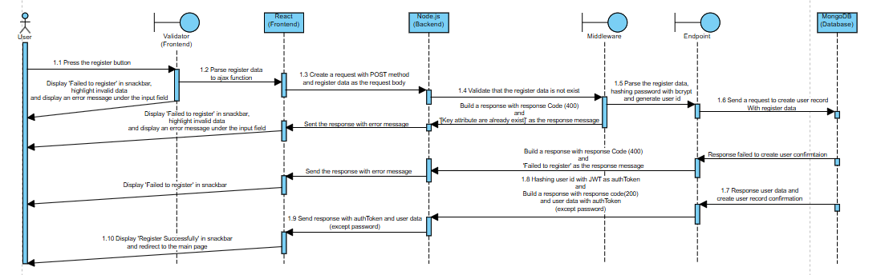
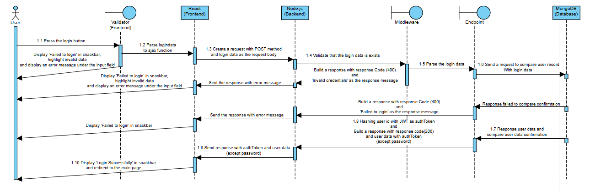
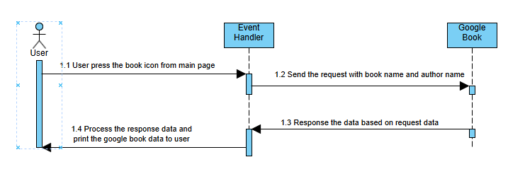
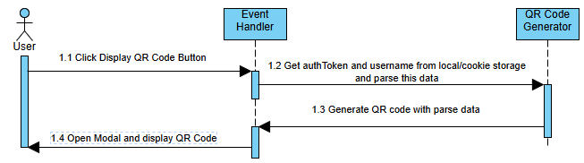
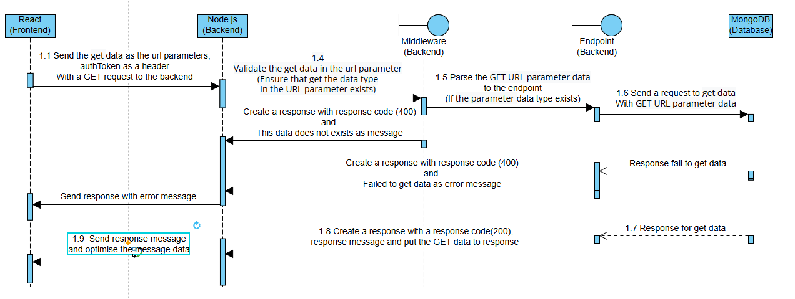
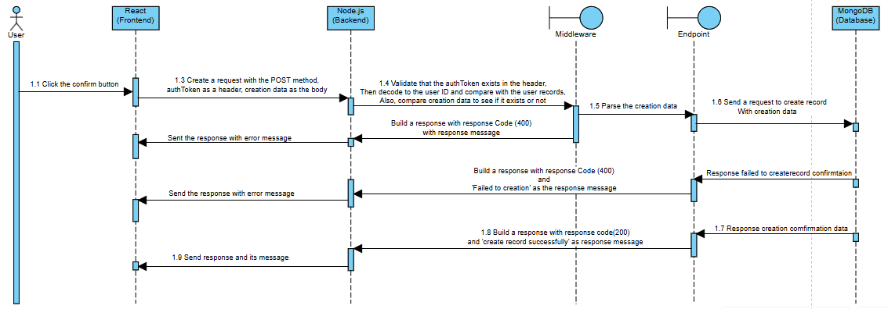
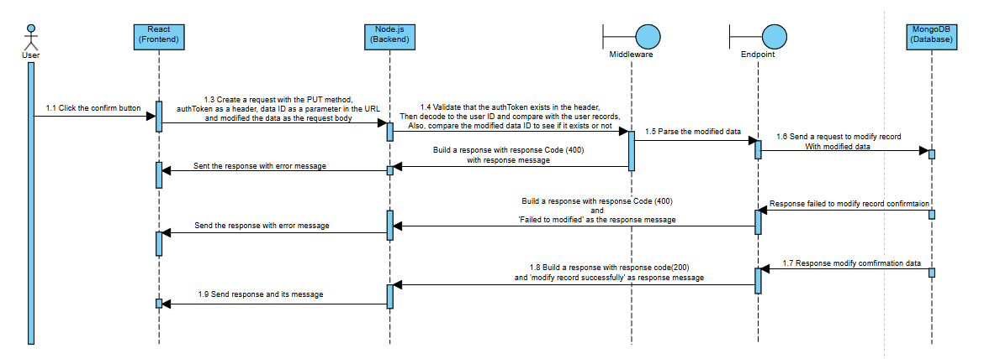
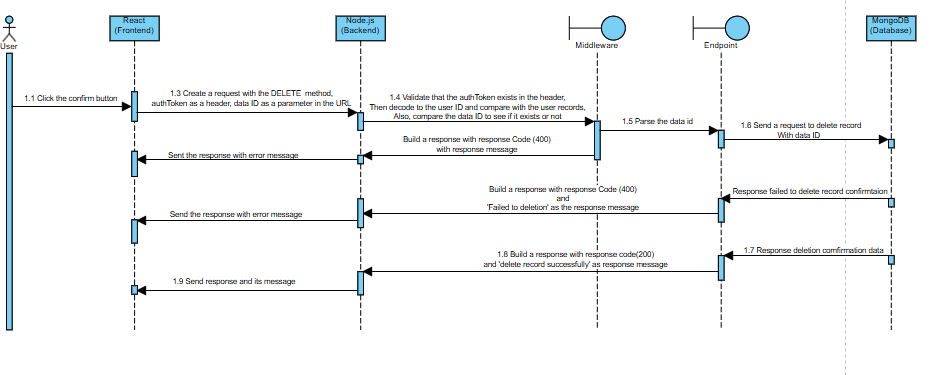
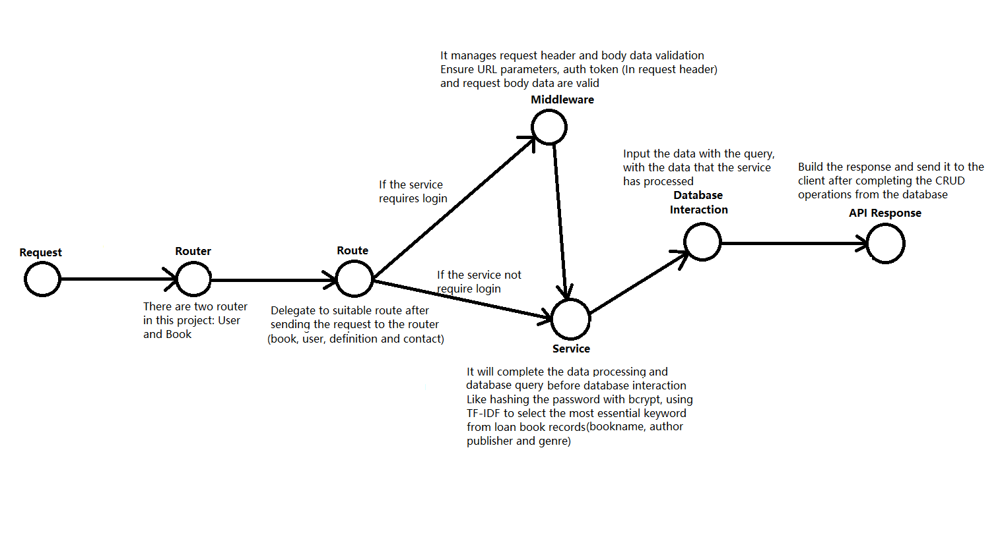
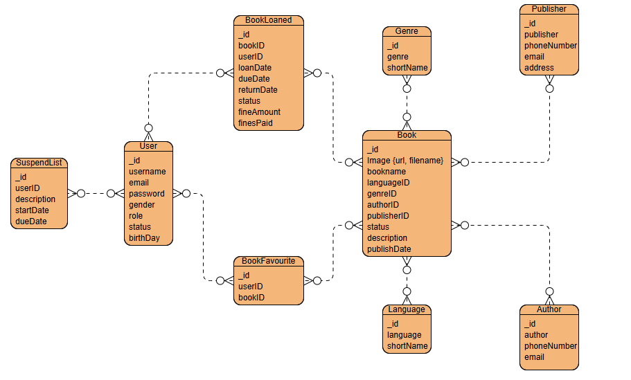

# MERN Library Management System
A full-stack application that streamlines library operations built as a Information Technology Project (ITP)

## Video for presentation and demonstration
- **[Presentation Video](https://youtu.be/QuyYn-r9Nr4):** An overview of the project concept, goals, and the inspiration behind it 
- **Demonstration Video:** A walkthrough of the project's features and live functionalities for each role
  - [For Non-Librarian (Guest User and Authenticate User)](https://youtu.be/CtT22CMBoSo)
  - [For Librarian](https://youtu.be/ae6o5S0cZn0)

## Table of Contents
- [Introduction](#introduction)
- [Features](#features)
- [Installation](#installation)
- [Architecture](#architecture)
- [UI Layout](#ui-layout)
- [API endpoints](#api-endpoints)
- [Technology Stack](#technology-stack)
- [Contributing](#contributing)
- [License](#license)

## Introduction
The MERN Library Management System is designed to modernize library operations by tackling key inefficiencies such as dependency on physical library cards and the absence of a recommendation system. Developed as part of the Information Technology Project (ITP), this system leverages the MERN stack with a TypeScript template to deliver an intuitive and efficient solution for librarians, library users, and guests.<br>
With features like QR code-based book loans, automated return tracking, TF-IDF-powered recommendations, and third-party API integration, this project showcases cutting-edge web technologies aimed at enhancing user experience and optimizing data management.

## Features
- **User Authentication:** Secure login system for librarians and users, leveraging JWT.
- **Library Data Management:** CRUD functionality for users, books, contacts, and book metadata.
- **QR Code Book Loans:** Scan QR codes to borrow books seamlessly.
- **Loan & Return Tracking:** Log borrowing transactions, returns, and fine management.
- **Book Recommendation System:** Uses TF-IDF and loan data analysis for personalized suggestions.
- **Third-Party API Integration:** Fetch book details (ratings, ISBN, etc.) via the Google Books API.

## Installation
1. **Clone the repository:**
   ```bash
   git clone https://github.com/TomWai821/MERN_LibraryManagementSystem.git
   cd MERN_LibraryManagementSystem

2. **Download dependencies:**
   ```bash
   npm install

3. **Import data into MongoDB**
   - Open MongoDB Compass and import the JSON file located in the MongoDBSchema folder
   - This JSON file contains the complete data schema required for the application

4. **Set up environment variable:**
   Create a .env file in the root directory with Configuration variables
   ```
   - `REACT_APP_GOOGLE_BOOKS_API_KEY` - The API key of Google Books
   - `REACT_APP_GOOGLE_BOOKS_BASE_URL` - The base URL for google books API (like https://www.googleapis.com/books/v1/volumes)
   - `REACT_APP_LOCAL_HOST` - The local host for backend (like http://localhost:${port}/api) 
   - `REACT_APP_MAIN_PAGE` - The local host for the main page (like http://localhost:${port})

   Remarks:
   - Express backend runs by default on port 5000
   - React frontend runs on port 3000
  
5. **Run the application:**
   ```bash
   # For the server side
   nodemon backend/index.ts  
   
   # For the client side
   npm start
   
   # For the user who download concurrency
   npm run both

## Architecture
**Frontend**<br>

**Sequence Diagram (Authentication)**<br>
<br>
This sequence diagram explain the flow of account registeration,
<br>
This sequence diagram explain the flow of account login,

**Sequence Diagram (Project Features)**<br>
<br>
This sequence diagram explain the flow of get data from Google Book,
<br>
This sequence diagram explain the flow of get Generate QR Code,
<br>
This sequence diagram explain the flow of book recommendation,

**Sequence Diagram (CRUD operations)**<br>
<br>
This sequence diagram explain the flow of GET data,
<br>
This sequence diagram explain the flow of POST method to create data,
<br>
This sequence diagram explain the flow of PUT method to update data,
<br>
This sequence diagram explain the flow of DELETE data,

**Backend**
Architecture Diagram<br>
<br>


**Database**
Entity-Relational Diagram(ERD)<br>
<br>
This ERD explain the database schema for the Library Management System

Collections related to book data:
- Book<br>
| Key Attribute |	Type     | Description                                                              |
| ------------- | -------- | ------------------------------------------------------------------------ |
| image         |	Object   | Stores book cover image details, including URL and filename              |
| bookname	    | String   | The title of the book for identification                                 |
| languageID	  | ObjectID | References for the Language collection, indicating the book's language   |
| genreID	      | ObjectID | References the Genre collection, categorising the book                   |
| authorID	    | ObjectID | Links to the Author collection, storing authorship details               |
| publisherID   |	ObjectID | Associates with the publisher collection for book publishing details     |
| status	      | String   | Defines the book’s availability, such as OnShelf and Loaned              |
| description	  | String   | Provides a brief overview or synopsis of the book                        |
| publishDate	  | Date     | The official publication date of the book, indexed for search efficiency |

- Genre<br>
| Key Attribute | Type   | Description                                                                   |
| ------------- | ------ | ------------------------------------------------------------------------------|
| genre         | String | The full name is used to represent the genre, ensuring correct classification |
| shortName     |	String | An abbreviated version of the genre name is used for display purposes         |

- Language<br>
| Key Attribute | Type   | Description                                                                   |
| ------------- | ------ | ------------------------------------------------------------------------------|
| language      | String | The full name used to represent the language, ensures correct classification  |
| shortName     |	String | An abbreviated version of the language name is used for display purposes      |

- Author<br>
| Key Attribute |	Type   | Description                                                                                 |
| ------------- | ------ | --------------------------------------------------------------------------------------------|
| publisher	    | String | The full name of the publisher, stored for identification purposes                          |
| phoneNumber	  | String | The contact number provided for communication with the publisher                            |
| email         | String | The email address used for professional or system-related correspondence with the publisher |

- Publisher<br>
| Key Attribute |	Type   | Description                                                                                 |
| ------------- | ------ | --------------------------------------------------------------------------------------------|
| author	      | String | The full name of the author, stored for identification purposes                             |
| phoneNumber	  | String | The contact number provided for communication with the publisher                            |
| email         | String | The email address used for professional or system-related correspondence with the publisher |

Collections related to user data:
- User<br>
| Key Attribute | Type   | Description                                   |
| ------------- | ------ | --------------------------------------------- |
| Username      | String | The unique display name chosen by the user    |
| Email         | String | Primary identifier for authentication         |
| Password      | String | Encrypted storage for login credentials       |
| Gender        | String | Captures gender identity for the user profile |
| Role          | String | Defines permissions for admin and user        |
| birthDay      | Date   | Stores the user’s date of birth               |
| avatarurl     | String | The URL for the avatar image                  |

- SuspendList<br>
| Key Attribute |	Type	    | Description                                                                                                |
| ------------- | --------- |----------------------------------------------------------------------------------------------------------- |
| userID        |	ObjectID  |	Links to the user collection, ensuring proper tracking of suspended individuals                            |
| description	  | String	  | Stores details about the reason for the user's suspension, ensuring proper enforcement of library policies |
| startDate	    | Date	    | The date when the user suspension begins                                                                   |
| dueDate	      | Date	    | The scheduled date when the suspension will end, allowing access restoration                               |


Collections related to interaction between book and user:
- BookFavourite<br>
| Key Attribute |	Type     | Description                                                                                          |
| ------------- | -------- | ---------------------------------------------------------------------------------------------------- |
| userID        |	ObjectID | References to the user collection to identify the user who has loaned books                          |
| bookID        |	ObjectID | References to the user collection to identify the loaned book                                        |
| loanDate      |	Date     | The date when the user loaned the book                                                               |
| dueDate       |	Date     | The date on which the book should return                                                             |
| returnDate    |	Date	   | The actual date when the book returns                                                                |
| Status	      | String   | Defines the loan status, such as Loaned, Returned                                                    |
| finesAmount   |	Number	 | The monetary fine for overdue book returns                                                           |
| finesPaid	    | String   | Indicate whether the fine was paid, with predefined statuses, like Paid, Not Paid, or No Fine Needed |

- BookLoaned<br>
| Key Attribute | Type     | Description                                                                  |
| ------------- | -------- | ---------------------------------------------------------------------------- |
| userID        | ObjectID | References the user collection to identify the user who favourited the books |
| bookID        | ObjectID | References the book collection to identify the favourite book                |

Remarks:
1. Every collection includes an _id field of type ObjectId, which serves as the unique identifier

## UI Layout
   
## API Endpoints
**For Authenication (click to expanded)**
1. For login
   ```
   Endpoint: `POST /api/user/Login`

   Request Body Example:
   {
      "email":"TimmyChan@gmail.com",
      "password: "123456"
   }
   ```
   
2. For Registration
   ```
   Endpoint: `POST /api/user/Register`
   
   Request Body Example:
   {
      "username":"Timmy Chan",
      "email":"TimmyChan@gmail.com",
      "password":"123456",
      "birthDay":"1/1/1999",
      "gender":"Male"
   }

   Validator in backend:
   1. Both request body are not allow null/empty value
   2. Username at least require 3 characters
   3. Password at least require 6 characters

   Remarks:
   1. User record creation are using register API (In registration page/User management page)
   2. Password will hashing with bcrypt
   3. birthDay will transfer to Date type in backend side
   ```


**For User Data (Require auth token in header):**
1. Get User data (For user management/suspend list)
   ```
   - Endpoint: `GET /api/user/UserData/tableName=:tableName` (For all record)
   - Endpoint: `GET /api/user/UserData/tableName=:tableName?username=a` (For username filtering)
   - Endpoint: `GET /api/user/UserData/tableName=:tableName?status=Normal` (For status filtering)
   - Endpoint: `GET /api/user/UserData/tableName=:tableName?role=User` (For role filtering)
   - Endpoint: `GET /api/user/UserData/tableName=:tableName?gender=Male` (For gender filtering)

   Remarks:
   1. tableName = SuspendUser/AllUser
2. Get User data (For the direct user only)
   ```
   Endpoint: `GET /api/user/UserData`

   Remarks:
   1. It just require the auth token in header
5. Modify User data 
   ```
   Endpoint: `PUT /api/user/UserData/id=:id`

   Request Body Example:
   {
      "username": "Johnny Chan",
      "password": "444444",
      "gender":"Female",
      "role":"Admin"
   }

   Remarks:
   1. id = MongoDB ObjectID in user collection
   ```
   
6. Modify User data (For user himself)
   ```
   Endpoint: `PUT /api/user/UserData/type=:type`
   
   Request body(For username):
   {
      "username": "Jacky Wong"
   }

   Request body(For password):
   {
      password: "444444"
   }

   Remarks:
   1. type = username/password
   2. It will get the data from user collection with auth token(unhashed by JWT, then transfer to userID) before modify the username/password
   ```
   
7. Modify user Status (Include Suspend User/Unsuspend User)
   ```
   Endpoint: `PUT /api/user/Status/id=:id`

   Request Body Example(For Suspend User):
   {
      "StatusForUserList": "Suspend",
      "description": "Does not return book many times",
      "startDate": "9-6-2025T04:06:50.006+00:00",
      "dueDate": "9-7-2025T04:06:50.006+00:00"
   }

   Request Body Example(For Unsuspend User):
   {
      "StatusForUserList": "Normal",
   }

   Remarks:
   1. id = MongoDB ObjectID in user collection
   ```
   
8. Delete User data
   ```
   EndPoint: `DELETE /api/user/User/id=:id`

   Remarks:
   1. id = MongoDB ObjectID in user collection
   ```

   
**For Suspend List (Require auth token in header):**
   1. Modify Suspend List data
      ```
      Endpoint: `PUT /SuspendListData/id=:id`

      Request Body Example:
      {
         "banListID":""
         "dueDate":"8-7-2025T04:06:50.006+00:00"
         "description":"Does not return books and paid fines many time"
      }

      Remarks:
      1. id = the MongoDB ObjectID in user collection, it use to ensure the account was exist
      2. banListID = the MongoDB ObjectID in suspendList
      ```


**For Book Data (Require auth token in header)**
   1. Get book data
      ```
      - Endpoint:`GET /api/book/BookData` (For all books)
      - Endpoint:`GET /api/book/BookData?bookname=a` (For all books with bookname filtering)
      - Endpoint:`GET /api/book/BookData?status=OnShelf` (For all books with status filter)
      - Endpoint:`GET /api/book/BookData?authorID=""` (For all books with authorID filtering)
      - Endpoint:`GET /api/book/BookData?publisherID=""` (For all books with publisherID filtering)
      - Endpoint:`GET /api/book/BookData?genreID=""` (For all books with genreID filtering)
      - Endpoint:`GET /api/book/BookData?languageID=""` (For all books with languageID filtering)

      Remarks:
      1. authorID = MongoDB ObjectID in author collection
      2. publisherID = MongoDB ObjectID in publisher collection
      3. genreID = MongoDB ObjectID in genre collection
      4. languageID = MongoDB ObjectID in language collection
      ```
      
   2. Create book record
      ```
      Endpoint:`POST /api/book/BookData`

      Request Body Example:
      {
         "bookname":"Beast Senpai Travelling Diary",
         "languageID":"",
         "genreID":"",
         "authorID":"",
         "publisherID":"",
         "description":"It collect the photo about the fun facts during beast senpai travelling",
         "publishDate":"2005-07-16T00:00:00.000+00:00"
      }

      Remarks:
      1. authorID = MongoDB ObjectID in author collection
      2. publisherID = MongoDB ObjectID in publisher collection
      3. genreID = MongoDB ObjectID in genre collection
      4. languageID = MongoDB ObjectID in language collection
      ```
      
   3. Modify book record
      ```
      Endpoint:`PUT /api/book/BookData/id=:id`

      Request Body Example:
      {
         "bookname":"Beast Senpai Travelling Diary",
         "languageID":"",
         "genreID":"",
         "authorID":"",
         "publisherID":"",
         "description":"It collect the photo about the fun fact during beast senpai travelling, and it cost $114514",
         "publishDate":"2005-07-16T00:00:00.000+00:00"
      }

      Remarks:
      1. authorID = MongoDB ObjectID in author collection
      2. publisherID = MongoDB ObjectID in publisher collection
      3. genreID = MongoDB ObjectID in genre collection
      4. languageID = MongoDB ObjectID in language collection
      5. id = MongoDB ObjectID in book collection
      ```
      
   4. Delete book record
      ```
      Endpoint:`DELETE /api/book/BookData/id=:id``

      1. id = MongoDB ObjectID in book collection
      ```

**For Loan Books Data (Require auth token in header):**
1. Get Loan book record
   ```
   - Endpoint: `GET /api/book/LoanBook` (For all loan book record)
   - Endpoint: `GET /api/book/LoanBook?status=Returned` (For loan book record with status filtering)
   - Endpoint: `GET /api/book/LoanBook?bookname=Harry` (For loan book record with bookname filtering)
   - Endpoint: `GET /api/book/LoanBook?username=a` (For loan book record with username filtering)
   - Endpoint: `GET /api/book/LoanBook?finesPaid=Paid` (For loan book record with finesPaid status filtering)
   ```
   
2. Create Loan book record
   ```
   Endpoint: `POST /api/book/LoanBook`

   Request Body Example:
   {
      "userID":"",
      "bookID":"",
      "loanDate":"2025-06-09T00:00:00.000+00:00",
      "dueDate":"2025-06-16T00:00:00.000+00:00"
   }

   Remarks:
   1. userID = MongoDB ObjectID in user collection
   2. bookID = MongoDB ObjectID in book collection
   3. It will change book status after loan record created
   ```
   
3. Modify Loan book record
   ```
   Endpoint: `PUT /api/book/LoanBook/id=:id`

   Request Body Example:
   {
      "finesPaid": "Not paid needed"
   }

   Remarks:
   1. It will change the loan record status to returned/returned(late), based on the date to send the request(return book)
   2. finesPaid could be "Not paid needed"/"Not paid"/"paid"
   3. id = MongoDB ObjectID in bookloaned collection
   ```

   
**For Favourite Book (Require auth token in header):**
1. Get favourite book record
   ```
   Endpoint:`GET /api/book/FavouriteBook`
   ```
   
2. Create a favourite book record
   ```
   Endpoint:`POST /api/book/FavouriteBook`

   Request body Example:
   {
      "bookID":""
   }

   Remarks:
   1. It will get the userID from auth token(unhash by jwt)
   2. BookID  = MongoDB ObjectID in book collection
   ```
   
3. Delete a favourite book record
   ```
   Endpoint:`DELETE /api/book/FavouriteBook/id=:id`

   Remarks:
   1. id = MongoDB ObjectID in favourite book collection
   ```
   
**For Book data definition (Require auth token in header):**
1. Create a new definition data:
   ```
   - Endpoint: `GET /api/book/definition/type=:type`
   - Endpoint: `GET /api/book/definition/type=:Genre?genre=N` (Search genre with filter data)
   - Endpoint: `GET /api/book/definition/type=:Language?language=En` (Search language with filter data)

   Remarks:
   1. type = Genre/Language
   ```
   
2. Get the whole definition data:
   ```
   Endpoint: `POST /api/book/definition/type=:type`

   Request Body Example(For Genre):
   {
      "genre":"Science Fiction",
      "shortName":"SF"
   }

   Request Body Example(For Language):
   {
      "language":"English",
      "shortName":"EN"
   }

   Remarks:
   1. type = Genre/Language
   2. Here also has URL paramters(type) validation
   ```
   
3. Update the definition data:
   ```
   Endpoint: `PUT /api/book/definition/type=:type?id=""`

   Request Body Example(For Genre):
   {
      "genre":"Science Fiction",
      "shortName":"SF"
   }

   Request Body Example(For Language):
   {
      "language":"English",
      "shortName":"EN"
   }

   Remarks:
   1. type = Genre/Language
   2. id = MongoDB ObjectID in langauge/genre collection
   ```
   
4. Delete the definition data:
   ```
   Endpoint: `DELETE /api/book/definition/type=:type?id=""`

   Remarks:
   1. type = Genre/Language
   2. id = MongoDB ObjectID in langauge/genre collection
   ```
   
**For contact data (Require auth token in header):**
1. Creating a new contact:
   ```
   Endpoint: `GET /api/book/contact/type=:type`
   
   Request Body Example(Author):
   {
      "author":"author",
      "phoneNumber: "N/A",
      "email": "N/A"
   }
   
   Request Body Example(Publisher):
   {
      "publisher":"publisher",
      "phoneNumber: "N/A",
      "email": "N/A"
   }
   ```
   
2. Get the whole contact data:
   ```
   -Endpoint: `POST /api/book/contact/type=:type`
   -Endpoint(For author filtering): `POST /api/book/contact/type=Author?author=a`
   -Endpoint(For publisher filtering): `POST /api/book/contact/type=Publisher?publisher=a`
   ```
   
3. Update the contact data:
   ```
   Endpoint: `PUT /api/book/contact/type=:type`
   
   Request Body Example(Author):
   {
      "id": ""
      "author": "author",
      "phoneNumber: "12345678",
      "email": "author@gmail.com"
   }
   
   Request Body Example(Publisher):
   {
      "id": ""
      "publisher": "publisher",
      "phoneNumber: "12345678",
      "email": "publisher@gmail.com"
   }
   
   Remarks:
   1. id = MongoDB ObjectID in author/publisher collection
   ```
   
4. Delete the contact data:
   ```
   Endpoint: `DELETE /api/book/contact/type=:type`
   
   Request Body Example:
   {
      "id": ""
   }
   
   Remarks:
   1. id = MongoDB ObjectID
   ```

**Response**
- If failed to implement CRUD operations:
   ```
   {
     "success": false,
     "error": ""
   }

- If implement CRUD operations/Authenticate successfully

  - For Authenticate
     ``` 
     {
       "success": true,
       "authtoken": ""
     }

  - For User Data
    ```
    {
      "success": true,
      "foundUser": [ {/* user data */} ]
    }

  - For Book data
    ``` 
    {
      "success": true,
      "foundBook": [ {/* book data */} ]
    }

  - For Definition Data
    ```
    {
      "success": true,
      "foundDefinition": [ {/* definition data */} ]
    }

  - For Contact Data
    ```
    {
      "success": true,
      "foundContact": [ {/* contact data */}]
    }

  - For Loan Book Data
    ```
    {
      "success": true,
      "foundLoanBook": [ {/* loan book data */}]
    }

  - For Favourite Book Data
    ```
    {
      "success": true,
      "foundFavouriteBook": [ {/* user favourite book data */}]
    }
## Technology Stack
- **Front-end:** React, Material-UI for styling
- **Back-end:** Node.js, Express.js
- **Database:** MongoDB, Mongoose (With Nodemon for development)
- **Image Data Handling:** Multer
- **Data security:** JWT(JSON web token) for Authentication, Bcrypt for password hashing
- **TF-IDF Algorithms:** natural
- **Other**: RESTful APIs with modular design


## Contributing
1. Fork the repository.
2. Create a new branch (`git checkout -b ${branchname}`).
3. Commit your changes (`git commit -m "comment"`).
4. Push the branch (`git push origin`).
5. Open a Pull Request.

## License

MIT License

Copyright (c) 2025 TomWai821

Permission is hereby granted, free of charge, to any person obtaining a copy  
of this software and associated documentation files (the "Software"), to deal  
in the Software without restriction, including without limitation the rights  
to use, copy, modify, merge, publish, distribute, sublicense, and/or sell  
copies of the Software, and to permit persons to whom the Software is  
furnished to do so, subject to the following conditions:

The above copyright notice and this permission notice shall be included in all  
copies or substantial portions of the Software.

THE SOFTWARE IS PROVIDED "AS IS", WITHOUT WARRANTY OF ANY KIND, EXPRESS OR  
IMPLIED, INCLUDING BUT NOT LIMITED TO THE WARRANTIES OF MERCHANTABILITY,  
FITNESS FOR A PARTICULAR PURPOSE AND NONINFRINGEMENT. IN NO EVENT SHALL THE  
AUTHORS OR COPYRIGHT HOLDERS BE LIABLE FOR ANY CLAIM, DAMAGES OR OTHER  
LIABILITY, WHETHER IN AN ACTION OF CONTRACT, TORT OR OTHERWISE, ARISING FROM,  
OUT OF OR IN CONNECTION WITH THE SOFTWARE OR THE USE OR OTHER DEALINGS IN THE  
SOFTWARE.
